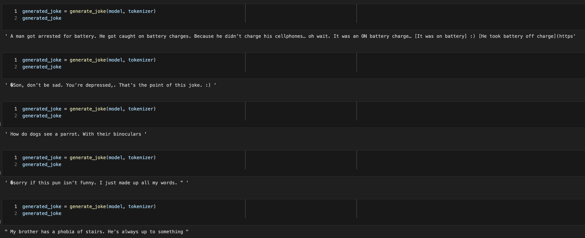

# Joke-generator : A GPT2 model fine-tuned on two various jokes dataset

In this project, I have trained two transformer models (GPT2 model and tokenizer) in order to generate short jokes : the shortjokes dataset (over 230k jokes scrapped on reddit) and the dadjokes dataset (over 50k dadjokes).

Then, there are two notebooks both doing the same task.

 - In **the dadjokes subfolder** I have used the pretrained HuggingFace library's GPT2 model and we only fine tune this model on the dadjokes dataset. For computational reasons, I chose to limit/reduce the size of the dataset in order to keep only the medium-length jokes. Since we are using transfer learning and are fine tuning the weights, I also chose to train it for only 3 epochs; after which we tend to get good results.

 *Result of joke generation*
 

 - In **the shortjokes subfolder** Similarly to our previous model, I have trained a GPT2 model on the dadjokes dataset. Unfortunately, this dataset contains a lot of racist and sexist jokes as it is simply scrapped from reddit. For computational reasons, I chose to only train it for two epochs. It gives quite good results even if with a longer training, we could have improved it.

 *Results*
 
 
